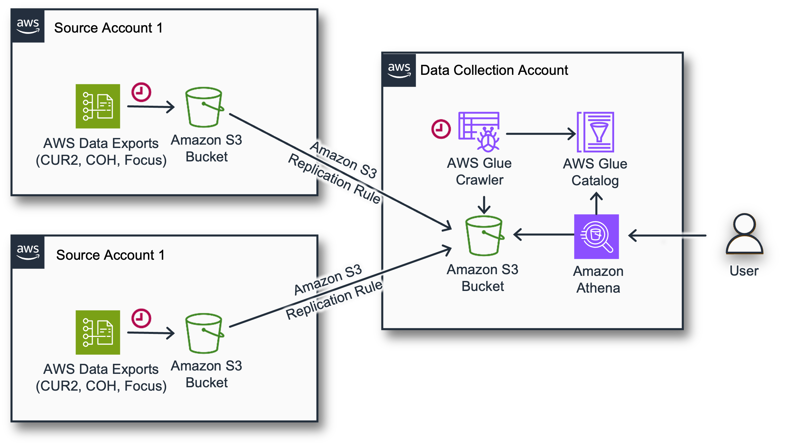

# Account Cost Monitoring

This project provides a dashboard and infrastructure for AWS Cost and Usage Report 2.0 (CUR 2.0). It uses Terraform
to provision the infrastructure and Helm to deploy the dashboard.

## Architecture

The [AWS Data Exports](https://docs.aws.amazon.com/cur/latest/userguide/what-is-data-exports.html) service
allows you to create billing and cost management data exports and publish them in Amazon S3 bucket. You can receive
reports that break down your AWS account costs by the hour, day, or month, by product or product resource,
or by tags that you define yourself. You can then visualize data by integrating with Athena and Grafana.



- Data Collection Account (or Centralized Monitoring Account) is used to consolidate, analyze or/and visualize the data.
- Source Account is the account where stack will create AWS Data Exports. Typically it can be one or many Linked Accounts
  or Management (Payer) Accounts.

## Introduction

This repo contains Terraform modules to automate the following tasks:

- **Create AWS CUR2 Data Exports:** Set up exports for Cost And Usage Report (CUR) 2.0 to be delivered to an Amazon S3 bucket in your account.
- **Cross-Account Replication:** Replicate the exported data to dedicated Data Collection AWS account for centralized analysis or auditing purposes.
- **Athena Table Creation:** Create Amazon Athena tables for querying the exported data directly, enabling data analysis and visualization.

## Prerequisites

- Make sure you have access to the Source and Destination accounts allowing you to deploy Terraform stacks.
- Centralized Monitoring Stack for data visualization is not part of the setup. This can be either self-managed Grafana
running in Kubernetes cluster or AWS Managed Grafana or some other monitoring tools such as Amazon QuickSight.

## Deployment

The deployment process consists of 3 steps. The first is in Destination/Data Collection account, and the 2nd in one or multiple Source Accounts.

### Step 1 of 3: In Data Collection/Centralized Monitoring Account

Terraform module [cur_data_analytics](modules/cur_data_analytics) can be used:

- Create Destination for Data Exports aggregation 
- Setup AWS Glue and Athena for data analysis

Refer module [README](modules/cur_data_analytics/README.md) for more detail.

### Step 2 of 3: In Management/Payer/Source Account

Terraform module [cur_data_export](modules/cur_data_export) can be used:

- Create AWS Data Exports for Cost And Usage Report (CUR) 2.0
- Setup Amazon S3 Replication Rules

Refer module [README](modules/cur_data_export/README.md) for more detail.

### Step 3 of 3: Data analysis and visualization

After loading your CUR 2.0 export data into a data analytics tool, you are ready to query Athena and
setup Grafana dashboard in order to gain cost and usage insights.

- Query Athena data export `data` table in database (e.g. "${var.resource_prefix}-data-export") in Amazon Athena query console.
For example, the following query shows year-to-date costs by service for each month. Update the year to see current year-to-date costs.

```
SELECT line_item_product_code,
    sum(line_item_blended_cost) AS cost, month
FROM data
WHERE year='2015'
GROUP BY  line_item_product_code, month
HAVING sum(line_item_blended_cost) > 0
ORDER BY  line_item_product_code;
```

- Proceed with setting up Grafana Athena datasource and setup
[AWS cost monitoring dashboard](charts/aws-cost-monitoring/dashboards/aws-cur2-billing-dashboard.json) in Grafana.

**Using [aws-cost-monitoring Helm chart](charts/aws-cost-monitoring/) for deployment:**

```
helm repo add aws-cost-monitoring https://raw.githubusercontent.com/ga-dpas/aws-account-cost-monitoring/gh-pages/
helm install my-aws-cost-monitoring aws-cost-monitoring/aws-cost-monitoring --values values.yaml
```

**Alternatively, you can add datasource and dashboard manually as below:**

_Grafana Athena Datasource Configuration:_

```yaml
apiVersion: v1
kind: ConfigMap
metadata:
  name: grafana-athena-datasource
  namespace: grafana # Replace with your Grafana namespace
  # Set the label required for grafana sidecar to detect the datasources
  labels:
    grafana_datasource: "1"
data:
  athena.yaml: |
    apiVersion: 1
    datasources:
      - name: Athena
        type: grafana-athena-datasource # This is the plugin ID for the Athena data source
        access: proxy
        orgId: 1
        url: http://localhost:4000 # Or your Grafana service URL if accessing externally
        isDefault: false
        editable: true
        jsonData:
          authType: default # Use default AWS credential chain or 'keys' for explicit keys
          defaultRegion: ap-southeast-2 # Replace with Athena AWS region
          assumeRoleArn: arn:aws:iam::123456789012:role/GrafanaAthenaAccessRole  # Replace with grafana-athena role ARN
          catalog: "AwsDataCatalog"
          database: "${var.resource_prefix}-data-export"
          workgroup: "${var.resource_prefix}-athena-workgroup"  # Replace with Athena workgroup
        secureJsonData:
          # If using 'keys' for authType, store sensitive keys here as a Secret reference
          # accessKey: YOUR_AWS_ACCESS_KEY_ID # This should be referenced from a Kubernetes Secret
          # secretKey: YOUR_AWS_SECRET_ACCESS_KEY # This should be referenced from a Kubernetes Secret
```

_Grafana AWS CUR Billing Report Configuration:_

```yaml
apiVersion: v1
kind: ConfigMap
metadata:
  name: aws-cur2-billing-dashboard
  # Set the label required for grafana sidecar to detect the dashboards
  labels:
    grafana_dashboard: "1"
data:
  aws_cur2_billing_dashboard.json: |
{{ .Files.Get "chart/aws-cost-monitoring/dashboards/aws-cur2-billing-dashboard.json" | indent 4 }}
```

## Examples

### Single account monitoring without S3 replication

```terraform
provider "aws" {
  alias  = "default"
  region = "ap-southeast-2"
  default_tags {
    tags = local.tags
  }
}

provider "aws" {
  alias  = "us-east-1"
  region = "us-east-1" # CUR is only available in us-east-1
  default_tags {
    tags = local.tags
  }
}

data "aws_caller_identity" "current" {}

locals {
  tags = {
    "cost_code"   = "xxxx"
    "project"     = "DPAS"
    "stack_name"  = "ACM"
    "environemnt" = "dev"
  }

  account_id         = data.aws_caller_identity.current.account_id
  resource_prefix    = "dpas-dev-acm"
  data_export_bucket = "${local.resource_prefix}-${local.account_id}-data-exports" # local bucket
}


module "cur2_data_export" {
  source = "git@github.com:ga-dpas/aws-account-cost-monitoring.git//module/cur_data_export?ref=main"

  resource_prefix       = local.resource_prefix

  deploy_data_export_s3   = true
  data_export_bucket_name = local.data_export_bucket
  enable_s3_replication   = false
  
  providers = {
    aws.default = aws.default
    aws.data_exports = aws.us-east-1
  }

  tags = local.tags
}

module "cur2_data_analytics" {
  source = "git@github.com:ga-dpas/aws-account-cost-monitoring.git//module/cur_data_analytics?ref=main"

  resource_prefix = local.resource_prefix
  data_exports_aggregate_bucket_name = local.data_export_bucket   # Data Export S3 bucket
  deploy_data_analytics = true   # Data analytics configuration

  tags = local.tags
}
```

### Multiple account monitoring with S3 replication in Data Aggregation account

```terraform
provider "aws" {
  alias  = "default"
  region = "ap-southeast-2"
  default_tags {
    tags = local.tags
  }
}

provider "aws" {
  alias  = "us-east-1"
  region = "us-east-1" # CUR is only available in us-east-1
  default_tags {
    tags = local.tags
  }
}

data "aws_caller_identity" "current" {}

locals {
  tags = {
    "cost_code"   = "xxxx"
    "project"     = "DPAS"
    "stack_name"  = "ACM"
    "environemnt" = "dev"
  }

  account_id                = data.aws_caller_identity.current.account_id
  data_aggregate_account_id = "123456789012"  # example
  resource_prefix           = "dpas-dev-acm"
  data_export_bucket        = "${local.resource_prefix}-${local.account_id}-data-exports-local" # local bucket
  data_exports_aggregate_bucket_name = "${local.resource_prefix}-${local.data_aggregate_account_id}-data-exports" # centralised bucket
}

# Deply to all Source Accounts
module "cur2_data_export" {
  source = "git@github.com:ga-dpas/aws-account-cost-monitoring.git//module/cur_data_export?ref=main"

  resource_prefix       = local.resource_prefix

  deploy_data_export_s3   = true
  data_export_bucket_name = local.data_export_bucket
  
  # NOTE: Enable this for multi account cost monitoring setup.
  # Centralised replication bucket must exists in your data aggregation account.
  # Creation of replication bucket is supported in `module/cur_data_analytics` TF module.
  enable_s3_replication = true
  data_exports_aggregate_bucket_name = local.data_exports_aggregate_bucket_name
  
  providers = {
    aws.default = aws.default
    aws.data_exports = aws.us-east-1
  }

  tags = local.tags
}

# Deploy to Data Aggregation Account
module "cur2_data_analytics" {
  source = "git@github.com:ga-dpas/aws-account-cost-monitoring.git//module/cur_data_analytics?ref=main"

  resource_prefix = local.resource_prefix

  # Data aggregation configuration
  data_exports_aggregate_bucket_name = local.data_exports_aggregate_bucket_name
  # Enable this for account cost monitoring S3 replication configuration
  deploy_data_export_aggregate_s3 = true
  enable_s3_replication           = true
  source_account_ids              = ["123456789012", "98745612312"] # example

  # Data analytics configuration
  deploy_data_analytics = true

  tags = local.tags
}
```

## Cost Estimation

Costs are associated with operating `Account Cost Monitoring` setup. Costs depend on various factors like
CUR2 DataExports configuration determines the size of the CUR, Data transfer and S3 storage cost, 
usage and the size of the datasets for example, the number of visuals on your dashboards, the number of Grafana users
and views per day, etc. Most implementations will be between $10 and $300/month, however it is advised to use
[AWS Pricing Calculator](https://calculator.aws/#/) to understand costs prior to deployment.

## References

- [AWS Data Exports](https://docs.aws.amazon.com/cur/latest/userguide/dataexports-create.html)
- [Cloud Intelligence Dashboards on AWS - Implementation Guide](https://docs.aws.amazon.com/guidance/latest/cloud-intelligence-dashboards/data-exports.html)
- [GitHub Repo: Cloud Intelligence Dashboards - Data Exports](https://github.com/aws-solutions-library-samples/cloud-intelligence-dashboards-data-collection/tree/main/data-exports)

## Contribute

Contributions to each component or new components are welcome by all individuals and teams.
Please create MR with the proposed changes or ideas and name the branch with `feature/<short-description-of-feature>`.
Please assign it to Zach Dicus and tag Ron Dilley and Jacob Charles in the description.

We look forward to your contributions!
